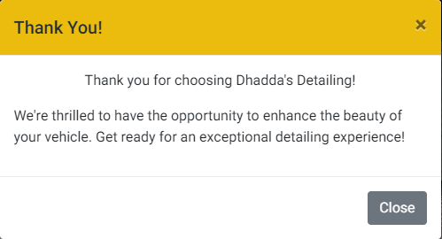

# Dhadda's Detailing

Dhadda's Detailing website is designed to be a responsive website. It allows visitors to view the services on offer and potentially make a booking.

![Dhadda's Detailing. Screen shot of website]

[View Dhadda's Detailing on Github Pages]

## CONTENTS

- [User Experience (UX)](<#User-Experience-(UX)>)

  - [User Stories](#User-Stories)

- [Design](#Design)

  - [Colour Scheme](#Colour-Scheme)
  - [Typography](#Typography)
  - [Imagery](#Imagery)
  - [Wireframes](#Wireframes)
  - [Features](#Features)
  - [Accessibility](#Accessibility)

- [Technologies Used](#Technologies-Used)

  - [Languages Used](#Languages-Used)
  - [Frameworks, Libraries & Programs Used](#Frameworks,-Libraries-&-Programs-Used)

- [Deployment & Local Development](#Deployment-&-Local-Development)

  - [Deployment](#Deployment)
  - [Local Development](#Local-Development)
    - [How to Fork](#How-to-Fork)
    - [How to Clone](#How-to-Clone)

- [Testing](#Testing)
  - [W3C Validator](#W3C-Validator)
  - [Solved Bugs](#Solved-Bugs)
  - [Known Bugs](#Known-Bugs)
  - [Testing User Stories](#Testing-User-Stories)
  - [Lighthouse](#Lighthouse)
    - [Index Page](#Index-Page)
    - [Books Page](#Books-Page)
    - [Contact Us Page](#Contact-Us-Page)
    - [Thank You Page](#Thank-You-Page)
  - [Full Testing](#Full-Testing)
- [Credits](#Credits)
  - [Code Used](#Code-Used)
  - [Content](#Content)
  - [Media](#Media)
  - [Acknowledgments](#Acknowledgments)

---

## User Experience (UX)

Dhadda's Detailing is a website demonstrating it's expertise in car detailing. It's main aim is to increase bookings via the website.

### User Stories

#### Client Goals

- To be able to view the site on a range of device sizes.
- To make it easy for potential customers to view the services/packages on offer.
- To make it obvious to customers how to reach us and where we are located.
- Have the ability to make a booking.

#### First Time Visitor Goals

- I want to find out what services are on offer.
- I want to see pictures of previous work carried out.
- I want to be able to navigate through the website with ease.
- I want to be able to book/make contact.

#### Returning Visitor Goals

- I want to be able to make a booking

## Design

### Colour Scheme

![Dhadda's Detailing Colour Palette]

### Typography

Google Fonts was used for the following fonts:

- is used for headings on the site. It is a serif font.

- is used for the body text on the site. It is a sans-serif font.

### Imagery

The images on the webpage were taken from unsplash.com. I have credited these in the [credits](#credits) section.

### Wireframes

Wireframes were created for mobile, tablet and desktop.

[Home Page Wireframe]

[Books Wireframe]

[Contact Us Wireframe]

### Features

The website consists of three pages and a modal. Home, Packages, Gallery and Booking modal.

#### All four pages have the following elements in common:

- A responsive navigation bar at the top of the page allowing the user to easily explore the website. On the left hand side of the navigation bar is the Dhadda's Detailing logo. On the right hand-side of the navigation bar are links to the packages page, gallery page and booking page. To enable a positive user experience the navigation links are condensed into a burger toggler button on smaller devices. This was done to prevent the navigation bar from looking cluttered.

- A footer which comprises of social media links to Facebook, Instagram, Twitter and Youtube. The footer also contains the address and phone number of the company.

#### Home Page

- A hero image displaying a photograph of a car dripping in soap suds.
- A heading and paragraph explaining who Dhadda's Detailing are.
- Three images of clean cars with a central button which takes the user through to the packages page.
- A testimonials section from previous customers. Again, this will give confidence to the user in the companies ability.
- A where to find us section, displaying a map from Google and the company address and phone number.

#### Packages Page

- A hero image displaying a clean car.
- The three packages which are on offer to the user.
- A book now button underneath the packages to allow the user easy access to the bookings modal.

#### Gallery Page

- A hero image displaying a clean car, to keep in theme with the rest of the website.
- A grid gallery showcasing Dhadda's detailing completed work. This will give confidence to the user in the companies ability.

#### Booking Modal

- A modal which is initiated from a Book Now button on the nav bar and the packages page.
- A form within the modal which requires the users input.
- A thank you modal, once the user has submitted the requested information.

#### Future Implementations

- Products page - This page would sell Dhadda's Detailing's own products.
- Add more services when they become available such as PPF and window tinting.

### Accessibility

I've taken care when coding to make the website as user-friendly and as accessible as I can. I've accomplished this by:

- Using semantic HTML.
- Using descriptive alt attributes for images throughout the site.
- Ensuring that the site has an adequate amount of colour contrast.

## Technologies Used

### Languages Used

- HTML and CSS

### Frameworks, Libraries & Programs Used

Balsamiq - Used to create wireframes.

Git - For version control.

Github - To save and store the files for the website.

Bootstrap Version 4.6 - The framework for the website. Code for the navigation bar, modal and various other classes.

Google Fonts - To import the fonts used on the website.

Google Dev Tools - To troubleshoot and test features, solve issues with responsiveness and styling.

[Birme](https://www.birme.net/) To resize images and change to webp format.

## Deployment

### Deployment

Github Pages was used to deploy the live website. The instructions to achieve this are below:

1. Log in (or sign up) to Github.
2. Find the repository for this project.?????????????
3. Click on the Settings link.
4. Click on the Pages link in the left hand side navigation bar.
5. In the Source section, choose main from the drop down select branch menu. Select Root from the drop down select folder menu.
6. Click Save. Your live Github Pages site is now deployed at the URL shown.

#### How to Clone

To clone the Dhadda's-Detailing repository:

1. Log in (or sign up) to GitHub.
2. Go to the repository for this project, ????????
3. Click on the code button, select whether you would like to clone with HTTPS, SSH or GitHub CLI and copy the link shown.
4. Open the terminal in your code editor and change the current working directory to the location you want to use for the cloned directory.
5. Type 'git clone' into the terminal and then paste the link you copied in step 3. Press enter.

## Testing

### W3C Validator

### Solved Bugs

1. When on smaller devices , bootstraps default toggle button, toggles all of the menu items to the left. I didn't want this, i wanted them to be central. in order to overcome the default bootstrap settings, I researched the bootstrap website to find the class 'align-items-center'. I applied this class to my unordered list, the menu items now appear in the center when the burger icon is clicked on smaller devices.

2. The text on the hero image on the index.html page were not re-sizing when transitioning onto smaller devices, they were covering the image more than i wanted them to. By using a media query I've managed to resize the text for a better viewing experience on smaller devices.

3. When adding the iframe to the the bootstrap column I wanted to centralize the iframe. I tried various classes off bootstrap to no avail. Through trial and error I found a combination of classes off bootstrap and my own custom CSS managed to overcome this obstacle.

4. Images were appearing stretched. After a little research I came across a solution using max-width:100%; and height:auto which is the bootstrap class img-fluid. This prevents the image from becoming distorted, it also helps with the responsiveness of images.

5. The middle image in the three images underneath the who are we section, was taller than the images beside it. I wanted them to all be the same height and width. At first I set a fixed height to the column and set the overflow to none. This looked great on the desktop but as the screen size decreased the same problem occurred. I felt that this wasn't a good viewing experience. In the end i ended up re-sizing the images using BIRME. The issue was resolved.

6. On the Packages.html page I've used Bootstraps grid layout. At first, I set the column width to 4. However, when adding a margin to each column it caused the end column to drop onto a new row. I didn't want this behavior. After reading the bootstrap literature, rather than taking up the whole row I opted for column width of 3 allowing me to center my content using the justify-content-center class and play around with margins.

### Known Bugs

1. The required fields on my book now modal do not work. This is because i'm using the data-dismiss attribute on the book button, the book button also triggers the opening of the thank you modal. The data-dismiss attribute doesn't take the required attribute into account. This should hopefully be resolved using Javascript.

### Testing User Stories

#### First Time Visitors

- I want to find out what services are on offer.

  - Users are able to navigate to the Packages page to see what packages are available to them.
    

- I want to see pictures of previous work carried out.

  - Previous work can be viewed by visiting the gallery page.
    

- I want to be able to navigate through the website with ease.

  - The navigation bar at the top of the page allows easy navigation throughout the website.
    

- I want to be able to book/make contact.
  - User's can easily make a booking using hte Book Now button. This button leads to a modal, which allows a user to select various options in order to make a booking. Upon a successful booking the user is presented with a thank you message.
    
    

#### Returning Visitors

- I want to be able to make a booking
  - Returning users can make a booking using the book now button on the navbar or from the book now button on the packages page.

### Lighthouse

## Credits

### Content

### Media

### Acknowledgments
