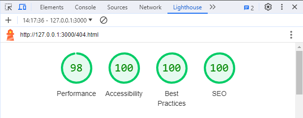

# Dhadda's Detailing

Dhadda's Detailing website is designed to be a responsive website. It allows visitors to view the services on offer and potentially make a booking.

[View Dhadda's Detailing on Github Pages](https://rdhadda.github.io/Dhaddas-Detailing/index.html)

## CONTENTS

- [User Experience (UX)](<#User-Experience-(UX)>)

  - [User Stories](#User-Stories)

- [Design](#Design)

  - [Colour Scheme](#Colour-Scheme)
  - [Typography](#Typography)
  - [Imagery](#Imagery)
  - [Wireframes](#Wireframes)
  - [Features](#Features)
  - [Accessibility](#Accessibility)

- [Technologies Used](#Technologies-Used)

  - [Languages Used](#Languages-Used)
  - [Frameworks, Libraries & Programs Used](#Frameworks,-Libraries-&-Programs-Used)

- [Deployment & Local Development](#Deployment-&-Local-Development)

  - [Deployment](#Deployment)
  - [Local Development](#Local-Development)
    - [How to Fork](#How-to-Fork)
    - [How to Clone](#How-to-Clone)

- [Testing](#Testing)
  - [W3C Validator](#W3C-Validator)
  - [Solved Bugs](#Solved-Bugs)
  - [Known Bugs](#Known-Bugs)
  - [Testing User Stories](#Testing-User-Stories)
  - [Lighthouse Testing](#Lighthouse-Testing)
  - [Wave Testing](#Wave-Testing)
  - [Full Testing](#Full-Testing)
- [Credits](#Credits)
  - [Code Used](#Code-Used)
  - [Media](#Media)
  - [Acknowledgments](#Acknowledgments)

---

## User Experience (UX)

Dhadda's Detailing is a website demonstrating it's expertise in car detailing. It's main aim is to drive bookings via the website.

### User Stories

#### Client Goals

- To be able to view the site on a range of device sizes.
- To make it easy for potential customers to view the services/packages on offer.
- To make it obvious to customers how to reach us and where we are located.
- Have the ability to make a booking.

#### First Time Visitor Goals

- I want to find out what services are on offer.
- I want to see pictures of previous work carried out.
- I want to be able to navigate through the website with ease.
- I want to be able to book/make contact.

#### Returning Visitor Goals

- I want to be able to make a booking

## Design

### Colour Scheme

I opted for a clean modern colour pallete where each colour compliments one another. The colour pallete was created using the [coolors](https://coolors.co/) website.

### Typography

Google Fonts was used for the following fonts:

- Roboto is used across the site for all text on the site. It is a sans-serif font.

### Imagery

All images on the webpage were taken from unsplash.com. I have credited these in the [credits](#credits) section.

### Wireframes

Wireframes were created for mobile, tablet and desktop using Balsamiq.

[Desktop Wireframes](docs/desktop-wireframe.png)

[Tablet Wireframes](docs/tablet-wireframe.png)

[Mobile Wireframes](docs/mobile-wireframe.png)

### Features

The website consists of three pages and a modal. Home, Packages, Gallery and Booking modal.

#### All three pages have the following elements in common:

- A responsive navigation bar at the top of the page allowing the user to easily explore the website. On the left hand side of the navigation bar is the Dhadda's Detailing logo. On the right hand-side of the navigation bar are links to the packages page, gallery page and booking modal. To enable a positive user experience the navigation links are condensed into a burger toggler button on smaller devices. This was done to prevent the navigation bar from looking cluttered.

- A footer which comprises of social media links to Facebook, Instagram, Twitter and Youtube. The footer also contains the address of the company.

#### Home Page

- A hero image displaying a photograph of a car dripping in soap suds.
- A heading and paragraph explaining who Dhadda's Detailing are.
- Three images of clean cars.
- A testimonials section from previous customers. Again, this will give confidence to the user in the companies ability.
- A where to find us section, displaying a map from Google and the company address, email and phone number. The map on the Homepage points to a coffee house in Ireland. As Dhadda's Detailing is not a real business I opted to use the iframe link from the coffee coders project.

#### Packages Page

- A hero image displaying a clean car.
- The three packages which are on offer to the user.
- Text explaining the packages.
- A book now button underneath the packages to allow the user easy access to the bookings modal.

#### Gallery Page

- A hero image displaying a clean car, to keep in theme with the rest of the website.
- Text welcoming users to the gallery page.
- A grid gallery showcasing Dhadda's detailing completed work. This will give confidence to the user in the companies ability.

#### Booking Modal

- A modal which is initiated from a Book Now button on the nav bar and the packages page.
- A form within the modal which requires the users input.
- A thank you modal, once the user has submitted the requested information.

#### Future Implementations

- Products page - This page would sell Dhadda's Detailing's own products.
- Add more services when they become available such as PPF and window tinting.

### Accessibility

I've taken care when coding to make the website as user-friendly and as accessible as I can. I've accomplished this by:

- Using semantic HTML.
- Using descriptive alt attributes for images throughout the site.
- Selecting a sans-serif font which is suitable for users with dyslexia.
- Ensuring that the site has an adequate amount of colour contrast.

## Technologies Used

### Languages Used

- HTML and CSS

### Frameworks, Libraries & Programs Used

[Balsamiq](https://balsamiq.com/) - Used to create wireframes.

[Visual Studio Code](https://code.visualstudio.com/) IDE used to create the website.

[Git](https://git-scm.com/) - For version control.

[Github](https://github.com/) - To save and store the files for the website.

[Bootstrap Version 4.2.1](https://getbootstrap.com/docs/4.2/getting-started/introduction/) - The framework for the website. Code for the navigation bar, modal and various other classes.

[Google Fonts](https://fonts.google.com/) - To import the fonts used on the website.

Google Dev Tools - To troubleshoot and test features, solve issues with responsiveness and styling.

[Birme](https://www.birme.net/) To resize images and change to webp format.

[Am I Responsive](https://ui.dev/amiresponsive) To show the website accross a range of devices.

[Fontawsome](https://fontawesome.com/start) For social links.

[Unsplash](https://unsplash.com/) For all images.

[My Free Logo Maker](https://myfreelogomaker.com/onboarding) For the site logo.

[Squoosh](https://squoosh.app/) Compress images.

## Deployment & Local Development

### Deployment

Github Pages was used to deploy the live website. The instructions to achieve this are below:

1. Log in (or sign up) to Github.
2. Find the repository for this project, Dhaddas-Detailing
3. Click on the Settings link.
4. Click on the Pages link in the left hand side navigation bar.
5. In the Source section, choose main from the drop down select branch menu. Select Root from the drop down select folder menu.
6. Click Save. Your live Github Pages site is now deployed at the URL shown.

### Local Development

#### How to Fork

To fork the repository:

1. Log in (or sign up) to Github.
2. Go to the repository for this project, rdhadda/Dhaddas-Detailing
3. Click the Fork button in the top right corner.

#### How to Clone

To clone the Dhadda's-Detailing repository:

1. Log in (or sign up) to GitHub.
2. Go to the repository for this project, rdhadda/Dhaddas-Detailing
3. Click on the code button, select whether you would like to clone with HTTPS, SSH or GitHub CLI and copy the link shown.
4. Open the terminal in your code editor and change the current working directory to the location you want to use for the cloned directory.
5. Type 'git clone' into the terminal and then paste the link you copied in step 3. Press enter.

## Testing

Testing was continuous throughout the website build. I used Chrome developer tools to identify and address any issues as they arose.

- Upon meeting with my mentor we identified that my initial colour scheme had contrast issues. This has been resolved by choosing a new colour scheme which allows for adequate contrast been background and foreground colours.

- My mentor also pointed out that the images within the website were .png format which hindered the performance of the website. To combat this all images have been converted to .webp format to significantly improve performance.

- On the Packages page. the list items were out of alignment and not centered even after using the bootstrap text-center class. This was due to padding, which has now been removed to center the list items.

### W3C Validator

W3C validator was used to validate the HTML on all pages of the website. It was also used to validate CSS in the style.css file.

One issue I was was coming across when testing my html page was an error displayed by w3. Trailing slash on void elements has no effect and interacts badly with unquoted attribute values.' However, even after removing these trailing slashes when saving my document Visual Studio Code would re-enter them. Luckily as w3 states these have no effect on the code.

- [Index Page HTML](docs/w3-index.html.png)
- [Packages Page HTML](docs/w3-packages.html.png)
- [Gallery Page HTML](docs/w3-gallery.html.png)
- [404 Page HTML](docs/w3-404.html.png)
- [style.css CSS](docs/w3-style.css.png)

### Solved Bugs

1. When on smaller devices , bootstraps default toggle button, toggles all of the menu items to the left. I didn't want this, i wanted them to be central. in order to overcome the default bootstrap settings, I researched the bootstrap website to find the class 'align-items-center'. I applied this class to my unordered list, the menu items now appear in the center when the burger icon is clicked on smaller devices.

2. The text on the hero image on the index.html page were not re-sizing when transitioning onto smaller devices, they were covering the image more than i wanted them to. By using a media query I've managed to resize the text for a better viewing experience on smaller devices.

3. When adding the iframe to the the bootstrap column I wanted to centralize the iframe. I tried various classes off bootstrap to no avail. Through trial and error I found a combination of classes off bootstrap and my own custom CSS managed to overcome this obstacle.

4. Images were appearing stretched. After a little research I came across a solution using max-width:100%; and height:auto which is the bootstrap class img-fluid. This prevents the image from becoming distorted, it also helps with the responsiveness of images.

5. The middle image in the three images underneath the who are we section, was taller than the images beside it. I wanted them to all be the same height and width. At first I set a fixed height to the column and set the overflow to none. This looked great on the desktop but as the screen size decreased the same problem occurred. I felt that this wasn't a good viewing experience. In the end i ended up re-sizing the images using BIRME. The issue was resolved.

6. On the Packages.html page I've used Bootstraps grid layout. At first, I set the column width to 4. However, when adding a margin to each column it caused the end column to drop onto a new row. I didn't want this behavior. After reading the bootstrap literature, rather than taking up the whole row I opted for column width of 3 allowing me to center my content using the justify-content-center class and play around with margins.

7. When deploying my website via github I noticed that some of the images on the gallery page were no longer rendering properly. After a google search I realised that the issue was to do with the aspect ratio of my images. After changing the aspect ratio the images now render correctly.

8.The lower large image on the gallery page on the desktop view is out of alignment with the 4 images to the left of it. After my meeting with my mentor he helped me diagnose the issue. The container for the image had a max height set to 512px, which was limiting the size of the image. I've since removed this and the pictures are now aligned.

### Known Bugs

1. The required fields on my book now modal do not work. This is because i'm using the data-dismiss attribute on the book button, the book button also triggers the opening of the thank you modal. The data-dismiss attribute doesn't take the required attribute into account. This should hopefully be resolved using Javascript.

### Testing User Stories

#### First Time Visitors

- I want to find out what services are on offer.

  - Users are able to navigate to the Packages page to see what packages are available to them.
    

- I want to see pictures of previous work carried out.

  - Previous work can be viewed by visiting the gallery page.
    

- I want to be able to navigate through the website with ease.

  - The navigation bar at the top of the page allows easy navigation throughout the website.
    

- I want to be able to book/make contact.

  - User's can easily make a booking using hte Book Now button. This button leads to a modal, which allows a user to select various options in order to make a booking. Upon a successful booking the user is presented with a thank you message.

    

    

#### Returning Visitors

- I want to be able to make a booking
  - Returning users can make a booking using the book now button on the navbar or from the book now button on the packages page.

### Lighthouse Testing

I took the opportunity to utilize Lighthouse within Chrome Developer Tools. This allowed me to test for performance, accessibility, best practices and the SEO (search engine optimization) of the website.

#### Index.html Desktop Page

#### Packages.html Desktop Page

#### Gallery.html Desktop Page

#### 404.html Desktop Page

The main recommendation to improve my lighthouse score were to appropriately size images. I achieved this by utilizing websites such as Birme and Sqoosh.

Another recommendation is to Eliminate render-blocking resources. However, these are resources such as Bootstrap and Google font's. These are key resources to my website.

Overall i'm happy with the Lighthouse scores for my desktop version of Dhadda's Detailing.

### Mobile Testing

#### Index.html Desktop Page

#### Packages.html Desktop Page

#### Gallery.html Desktop Page

#### 404.html Desktop Page

The main factor affecting the performance across all three pages is to Eliminate render blocking resources. As these resources play a key role in the website it's difficult to eliminate them.

I feel there is room for improvement for the performance of the mobile version of Dhadda's detailing. One method I tried to implement to improve this was to give my gallery images specific height and widths through media queries. Unfortunately this didn't improve my performance score. As my knowledge grows through the course I hope to improve on this.

### Wave Testing

### Full Testing

Full testing was performed on the following devices:

- Laptop:

  - Macbook Pro 2015 13 inch screen

- Mobile Devices:
  - iPhone 12 pro.
  - iPhone 11 pro.
  - Phone X.

Each device tested the site using the following browsers:

- Google Chrome
- Safari

#### Home Page

| Feature            | Expected Outcome                                                 | Testing Performed                  | Result                                      | Pass/Fail |
| ------------------ | ---------------------------------------------------------------- | ---------------------------------- | ------------------------------------------- | --------- |
| The sites logo     | Link directs the user back to the home page                      | Clicked title                      | Home page reloads                           | Pass      |
| Packages link      | Link directs user to Packages page                               | Clicked link                       | Packages page loads                         | Pass      |
| Gallery link       | Link directs user to Gallery page                                | Clicked link                       | Gallery page loads                          | Pass      |
| Links hover effect | All nav bar links highlight yellow when hovered over             | Hover over each button on the page | Each button turned yellow when hovered over | Pass      |
| Social links       | The corresponding social website opens on a new tab when clicked | Clicked social links               | Social website opens in new tab             | Pass      |
| Book Now Link      | Opens up booking modal                                           | Clicked link                       | Booking modal opens                         | Pass      |

#### Packages Page

| Feature                      | Expected Outcome                                                 | Testing Performed                  | Result                                      | Pass/Fail |
| ---------------------------- | ---------------------------------------------------------------- | ---------------------------------- | ------------------------------------------- | --------- |
| The sites logo               | Link directs the user back to the home page                      | Clicked title                      | Home page reloads                           | Pass      |
| Packages link                | Link directs user to Packages page                               | Clicked link                       | Packages page loads                         | Pass      |
| Gallery link                 | Link directs user to Gallery page                                | Clicked link                       | Gallery page loads                          | Pass      |
| Links hover effect           | All nav bar links highlight yellow when hovered over             | Hover over each button on the page | Each button turned yellow when hovered over | Pass      |
| Social links                 | The corresponding social website opens on a new tab when clicked | Clicked social links               | Social website opens in new tab             | Pass      |
| Book Now link                | Opens up booking modal                                           | Clicked link                       | Booking modal opens                         | Pass      |
| Book Now link under packages | Opens up booking modal                                           | Clicked link                       | Booking modal opens                         | Pass      |

#### Gallery Page

| Feature            | Expected Outcome                                                 | Testing Performed                  | Result                                      | Pass/Fail |
| ------------------ | ---------------------------------------------------------------- | ---------------------------------- | ------------------------------------------- | --------- |
| The sites logo     | Link directs the user back to the home page                      | Clicked title                      | Home page reloads                           | Pass      |
| Packages link      | Link directs user to Packages page                               | Clicked link                       | Packages page loads                         | Pass      |
| Gallery link       | Link directs user to Gallery page                                | Clicked link                       | Gallery page loads                          | Pass      |
| Links hover effect | All nav bar links highlight yellow when hovered over             | Hover over each button on the page | Each button turned yellow when hovered over | Pass      |
| Social links       | The corresponding social website opens on a new tab when clicked | Clicked social links               | Social website opens in new tab             | Pass      |
| Book Now Link      | Opens up booking modal                                           | Clicked link                       | Booking modal opens                         | Pass      |

#### Booking Modal

| Feature      | Expected Outcome         | Testing Performed | Result                   | Pass/Fail |
| ------------ | ------------------------ | ----------------- | ------------------------ | --------- |
| Book Button  | Opens confirmation modal | Clicked button    | Confirmation modal opens | Pass      |
| Close Button | Closes modal             | Clicked button    | Modal closes             | Pass      |

## Credits

### Code Used

I've used code's and classes courtesy of bootstrap, this can be seen throughout my code with comments.

### Media

All my media was taken from [Unsplash](https://unsplash.com/).

### Acknowledgments

- My mentor for their guidance and support.
- My cohort for support.
- Code institute for informative course material.
- The slack community for help and support.
